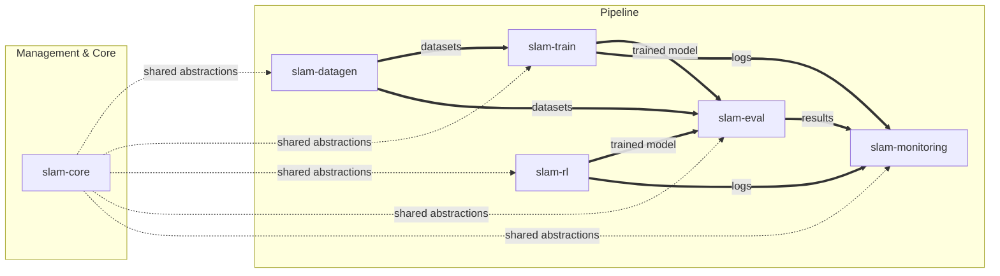

## Slam ecosystem constitution spec

### 1. Executive summary

#### 1.1 Project description 

The `slam` ecosystem is a suite of modular, composable libraries for the full lifecycle of foundational models (LLMs, vision, time series, etc.): data generation (`slam-datagen`), supervised training (`slam-train`), reinforcement learning (`slam-rl`), evaluation (`slam-eval`), and experiment monitoring (`slam-monitoring`). All repos share a common core (`slam-core`) that provides unified abstractions and training extensions, ensuring seamless data flow and consistent contracts across the entire pipeline.

#### 1.2 Project motivation

The goal is to provide a simple, controllable, and flexible ecosystem for all research projects related to foundational models, suitable for both educational and research purposes.

### 2. Requirement analysis

#### 2.1 Functional requirements

1. **Data generation**: Produce structured datasets for training and evaluation of various model types (LLMs, vision, time series, etc.)
2. **Model training**: Support supervised fine-tuning and reinforcement learning with pluggable backends
3. **Model evaluation**: Evaluate models on any dataset using configurable scorers and configurable inference engines
4. **Monitoring**: Aggregate training and evaluation results into structured reports with pluggable frontends
5. **Shared core**: Provide unified abstractions and training extensions that all repos depend on, eliminating duplication

#### 2.2 Non-functional requirements

1. **Simplicity**: Easy to understand, set up, and extend
2. **Flexibility**: Pluggable engines (e.g., swap `trl` for `unsloth` or custom loops via config), support for diverse model types
3. **Consistent configuration**: All repos use Hydra with a unified config structure
4. **Modularity**: Each repo is independently maintainable; adding a new component doesn't require changing existing ones
5. **Spec-driven development**: All repos follow SDD for project management

### 3. Acceptance criteria

1. **Shared dependency**: `slam-core` is installable as a package dependency by all ecosystem repos (`slam-datagen`, `slam-eval`, `slam-monitoring`, `slam-train`, `slam-rl`)
2. **End-to-end data flow**: A dataset produced by `slam-datagen` can be consumed by both `slam-train` for training and `slam-eval` for evaluation without manual conversion
3. **Train-eval handoff**: A model trained by `slam-train` can be loaded and evaluated by `slam-eval` using the same collection and scorer definitions
4. **Monitoring integration**: Evaluation results from `slam-eval` and training logs from `slam-train` can be ingested by `slam-monitoring` to produce reports
5. **Config consistency**: All repos use Hydra with a compatible config structure (shared defaults tree, consistent user settings pattern). Downstream repos extend `slam-core` configs via Hydra's `searchpath` plugin (`pkg://slam_core.config`)
6. **Engine pluggability**: The evaluation and training pipelines allow swapping the backend engine via a single config change (e.g., `engine: trl` → `engine: unsloth`)
7. **SDD compliance**: All repos follow the SDD methodology with constitution and general/kiss specs in `.internal/`

### 4. Insight

**Option 1: Centralized monorepo.** Keep all components (`datagen`, `train`, `rl`, `eval`, `monitoring`) in a single repository with subdirectories.
- **Pros:** Simple dependency management, easy cross-component changes, single spec location.
- **Cons:** Bloated repo, hard to maintain independent versioning, contributors must navigate a large codebase.

**Option 2: Independent repos with shared core.** Each component is a separate repository depending on `slam-core` for shared abstractions.
- **Pros:** Clean separation of concerns, independent versioning, focused scope for each contributor, reusable core.
- **Cons:** Requires package management across repos, more repos to maintain.

**Option 3: Independent repos with no shared core.** Each component reimplements its own abstractions.
- **Pros:** Maximum independence, no cross-repo dependencies.
- **Cons:** Duplication, divergent interfaces, brittle integration between training and evaluation.

**Decision:** Option 2. The modularity and separation benefits far outweigh the overhead of managing a shared package. The `slam-core` repo serves as both the shared library and the SDD management repo for the ecosystem.

### 5. Overall solution design

#### 5.1 High-level design

#### 5.2 Core components

1. **slam-core**: Shared abstractions and SDD management repo for the ecosystem
2. **slam-datagen**: Data generation library for foundational models
3. **slam-train**: Supervised fine-tuning and training library
4. **slam-rl**: Reinforcement learning and online alignment library
5. **slam-eval**: Evaluation library with configurable scorers and inference engines
6. **slam-monitoring**: Experiment monitoring with pluggable frontends

### 6. Implementation plan

#### 6.1 Todo list

1. [ ] Set up `slam-core` as an installable Python package with `pyproject.toml`
2. [ ] Extract shared abstractions from existing repos into `slam-core`
3. [ ] Extend `slam-core` with training support (mixins, loss functions, etc.)
4. [ ] Update existing repos (`slam-eval`, `slam-datagen`, `slam-monitoring`) to depend on `slam-core`
5. [ ] Create new component repos as needed (training, RL, etc.) with consistent structure
6. [ ] Extend component repos as needed to cover new research use cases
7. [ ] Establish shared Hydra defaults and `user_settings` pattern across all repos
8. [ ] Verify end-to-end data flow: datagen → train → eval → monitoring
