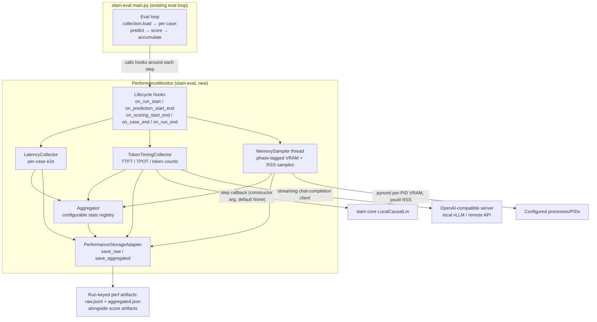

## Performance evaluation for slam-eval

### 1. Executive summary

#### 1.1 Spec description 

We add a performance-evaluation capability to slam-eval: while a standard accuracy-oriented evaluation runs, slam-eval measures end-to-end inference time per case, TTFT/TPOT for LLM models, prompt/generated token counts per case, and memory consumption (RAM of the relevant processes and VRAM/HBM of the relevant GPU processes) sampled concurrently with inference. Measured quantities are stored as (a) raw per-case records joined to eval cases by `case_id` and (b) run-level aggregates computed by a configurable set of statistics (min, max, mean, median, and quantiles such as q5/q95 by default). Performance results live in the same storage location as scores but as a separate, independent artifact — scores and the `EvalStorageAdapter` interface remain untouched. The capability covers the three hosting scenarios used in practice: in-process `LocalCausalLm`, a locally deployed OpenAI-compatible server (e.g. vLLM), and remote APIs (for which memory metrics are not measurable and are reported as null).

#### 1.2 Spec motivation

Accuracy alone is insufficient when selecting models, adapters, and serving configurations: fine-tuned models are compared by quality (LocalCausalLm), serving setups are optimized for latency/throughput (local vLLM), and remote APIs serve as baselines. Today slam-eval cannot answer any latency, tokenization, or memory question, so such comparisons require ad-hoc manual measurement outside the pipeline. Measuring performance *simultaneously* with a standard accuracy evaluation guarantees the numbers correspond to exactly the workload, prompts, and model configuration that produced the accuracy scores.

#### 1.3 Implementation repos

- **slam-core** — minimal, optional addition to `LocalCausalLm`: a per-generated-token step callback (constructor argument, default `None`, zero behavior change when unset) enabling TTFT/TPOT measurement for in-process models.
- **slam-eval** — everything else: the performance monitor component, collectors, memory sampler, configurable statistics, the performance storage adapter, Hydra configs, and tests.

### 2. Requirement analysis

#### 2.1 Functional requirements

1. **FR1 (Performance monitor component).** slam-eval provides a `PerformanceMonitor` component, instantiable via Hydra like the existing `model` / `collection` / `scorer` / `storage_adapter` components, which is attached to the evaluation loop and collects performance metrics while the standard accuracy-oriented evaluation executes. When the monitor is disabled in config (or omitted), the evaluation loop behaves exactly as before.
2. **FR2 (Per-case latency).** The monitor measures end-to-end wall-clock time (seconds, float) around each `model.predict(case["x"])` call and records it per eval case together with the case identifier (`case_id`) that joins the performance record to the eval case and its score. This metric is measured for all three hosting scenarios.
3. **FR3 (Token timing).** For LLM models the monitor measures, per case: TTFT (time to first generated token, seconds), TPOT (time per output token, seconds), `prompt_tokens` (count of prompt tokens), and `generated_tokens` (count of newly generated tokens; prompt tokens excluded). TPOT is computed as `(generation end time − TTFT) / (generated_tokens − 1)` and is null when fewer than 2 tokens are generated; TTFT is null when zero tokens are generated. When the hosting scenario cannot provide these metrics (e.g. remote API without streaming/usage reporting), the values are stored as null.
4. **FR4 (Token timing for in-process models).** `LocalCausalLm` (slam-core) accepts an optional per-generated-token step callback as a constructor argument with default `None`; when set, it is invoked once per generated decoding step during `generate()` and when unset the model behavior is unchanged. The slam-eval monitor uses this callback to implement FR3 for `LocalCausalLm`.
5. **FR5 (Token timing for OpenAI-compatible serving).** For `LlmViaOpenAiApi` (local vLLM server or remote API), the monitor measures TTFT/TPOT/token counts from a streaming chat-completion request: first streamed content chunk timestamps TTFT; inter-chunk deltas yield TPOT. Server-reported token usage in the final chunk (`stream_options.include_usage`, supported by vLLM) is preferred for `prompt_tokens`/`generated_tokens`; chunk counting is the documented fallback (approximate — a chunk may contain several tokens). If a remote API does not support streaming, the monitor performs the non-streaming request and stores only e2e time (FR2), with all FR3 metrics null. Streaming unavailability must be observable to the user through three signals: (a) the run metadata in `aggregated.json` contains a `streaming` block with `supported` (boolean) and `fallback_reason` (e.g. `streaming_request_rejected`, `usage_not_reported_chunk_counting_used`, `disabled_in_config`); (b) aggregates for ttft/tpot are stored with `n: 0` rather than omitted when nothing was measured; (c) a warning is logged at fallback time — but when non-streaming is explicitly configured (`disabled_in_config`), the fallback is intended behavior and only signals (a) and (b) apply, no warning is emitted.
6. **FR6 (Memory sampling).** The monitor runs a background sampler thread, at a configurable interval (default 0.1 s), that concurrently with inference records: VRAM/HBM usage of the configured GPU processes (per-process, via pynvml, not device-wide) and RSS of the configured processes (via psutil). Target processes are provided by explicit configuration: for `LocalCausalLm` the current process; for local vLLM serving the server PID is configured manually. Memory sampling is skipped (all memory metrics null) for remote-API scenarios where no local process hosts the model.
7. **FR7 (Phase tagging).** The evaluation loop tags each memory sample with the current phase: `predict` while `model.predict()` executes, `score` while the scorer executes, `idle` otherwise. The sampler does not pause; phase tagging replaces pausing. Aggregated memory statistics are computed over `predict`-phase samples only, at run level (not per case — sampling and per-case windows do not align 1:1). Raw samples of all phases are stored.
8. **FR8 (Configurable statistics).** The set of aggregate statistics is configurable (default: min, max, mean, median, q5, q95), implemented as an extensible registry mapping statistic name → function. Quantiles are parameterized (`qN` = N-th percentile), so any quantile is available via config without code changes; adding a new non-quantile statistic requires one registry entry.
9. **FR9 (Aggregation).** At run end the monitor aggregates each metric over the non-null per-case values (nulls excluded; each aggregate reports `n` — the number of values it was computed over). Memory metrics are aggregated over run-level `predict`-phase samples (FR7). Warmup cases (configurable count, default 0) are excluded from all aggregates while remaining present in raw records, tagged as warmup.
10. **FR10 (Performance storage).** Performance results are saved through a dedicated performance storage adapter — a new, narrow interface independent of `EvalStorageAdapter` (which remains score-specific and untouched) — with a local JSONL/JSON implementation storing, under a run-keyed path: `raw.jsonl` (one record per case: `case_id`, e2e time, TTFT, TPOT, token counts, warmup flag) and `aggregated.json` (per-metric statistic blocks with `n`, plus run metadata: model config reference, sample interval, warmup count excluded). Consolidation with `EvalStorageAdapter` is explicitly out of scope for this spec.
11. **FR11 (Scenario applicability matrix).** The implementation supports the following per hosting scenario, with unsupported metrics stored as null rather than causing failure: e2e — all scenarios; TTFT/TPOT/tokens — LocalCausalLm (via FR4 callback), local vLLM (streaming, FR5), remote API (streaming if available, else null); memory — LocalCausalLm (in-process) and local vLLM (manual server PID), null for remote API.

#### 2.2 Non-functional requirements

1. **NFR1 (Non-interference with accuracy results).** When the monitor is enabled, scores, score storage, and the content of prediction passed to scorers are unchanged; the monitor adds side artifacts only.
2. **NFR2 (Low measurement overhead).** The monitor's own overhead on measured latencies must be negligible (timer calls and in-memory appends only); the sampler thread must not block inference and must not run GPU-synchronizing operations.
3. **NFR3 (Fault tolerance).** Failures inside the monitor (e.g. pynvml unavailable, sampler thread error, server metrics unreachable) must not fail the accuracy evaluation: the affected metrics are recorded as null and a warning is logged, while scores are produced normally.
4. **NFR4 (Config-driven behavior).** All behavior switches (monitor on/off, statistics list, warmup count, sampling interval, memory targets/PIDs, streaming usage flags) are Hydra config options; no code edits are needed to change them.
5. **NFR5 (Unit conventions).** All times are seconds (float); all token counts are integers; all memory sizes are bytes (integers). Null is represented explicitly (JSON `null`) and is distinct from zero.

### 3. Acceptance criteria

Acceptance criteria are verified by automated tests (pytest, run in the slam venv) plus manual GPU/real-API validation steps. Tests use the slam-core tiny-model helper (`tests/test_local_causal_lm.py::_build_tiny_model_and_tokenizer`) for in-process model scenarios and fake HTTP servers / injected fake streams for the OpenAI path — no real GPU or real API is required except where stated (AC10, AC11).

1. **AC1 (FR1, NFR1 — off-path unchanged).** An evaluation run with the monitor disabled produces the same scores as the same run with the monitor enabled, and with the monitor disabled or omitted no performance files are created. The `PerformanceMonitor` is Hydra-instantiable.
2. **AC2 (FR2 — per-case e2e).** For each of the three model scenarios, a run over N≥3 cases produces a raw record per case containing a positive finite `e2e_time_s` and the correct `case_id` matching the eval case.
3. **AC3 (FR4 — step callback).** A unit test on `LocalCausalLm` (tiny model, CPU) verifies: (a) with callback `None`, predictions and generation are unchanged versus the current implementation; (b) with a callback set, it is invoked exactly `generated_tokens` times in generation order and the final prediction is unchanged.
4. **AC4 (FR3/FR4 — token timing, in-process).** For a `LocalCausalLm` run with the callback: each raw record has non-null `ttft_s`, `prompt_tokens`, `generated_tokens` matching the actual tokenization (prompt tokens = encoded prompt length, generated = callback invocations); `tpot_s` satisfies the FR3 formula and is null iff `generated_tokens < 2`; all times are positive floats in seconds.
5. **AC5 (FR5 — streaming OpenAI path).** Against a fake OpenAI-compatible streaming server: TTFT equals the delay of the first content chunk (within tolerance), token counts prefer the server-reported usage over chunk counts when both are available, and TPOT matches the FR3 formula. Against a fake non-streaming server: e2e is recorded, FR3 metrics are null, `aggregated.json` contains the `streaming` block with `supported: false` and the correct `fallback_reason` (`streaming_request_rejected` vs `disabled_in_config`), `n: 0` blocks appear for ttft/tpot, and a warning is logged exactly when the fallback is not config-intended.
6. **AC6 (FR6/FR7 — memory sampling).** With a sampler interval of e.g. 0.05 s and a model scenario that takes measurable time: raw samples are stored with phase tags covering `predict` and at least one other phase across a run; `predict`-phase samples exist for the run; VRAM is sampled per-process (a unit test with pynvml mocked/faked verifies only the configured PID is queried); RSS is sampled for the configured PIDs. For a remote-API scenario (no local model process configured), memory metrics are null and no sampler runs.
7. **AC7 (FR8/FR9 — aggregation).** Given a constructed set of per-case values with known nulls, warmups, and memory samples: aggregates match independently computed min/max/mean/median/q5/q95; nulls are excluded and `n` equals the non-null count; warmup cases are absent from aggregates but present in raw with the warmup flag; a configured non-default statistic (e.g. `q99`) appears in output without code changes; memory aggregates are computed over `predict`-phase samples only.
8. **AC8 (FR10 — storage layout).** After a run, the run-keyed directory contains `raw.jsonl` (one JSON object per line, FR2/FR3 fields plus warmup flag) and `aggregated.json` (per-metric statistic blocks with `n`, `run_metadata` with model config reference, sample interval, warmup count, and — for OpenAI-path runs — the `streaming` block). The storage is written through the dedicated performance storage adapter; `EvalStorageAdapter` and score artifacts are untouched.
9. **AC9 (NFR3 — fault tolerance).** With pynvml intentionally unavailable (import blocked) and a fake sampler failure injected: the evaluation completes with correct scores, affected metrics are null, and warnings are logged — no exception propagates to the eval loop.
10. **AC10 (manual GPU smoke, not automated).** On the GPU host: one short slam-eval run against LocalCausalLm (tiny real model) and one against a local vLLM server, with the monitor enabled — verifying end-to-end that perf artifacts appear alongside scores, VRAM is non-zero and plausible, and TTFT/TPOT are within expected magnitudes.
11. **AC11 (manual real-API validation, not committed to the test suite).** Independently of AC5's fake-server tests, validate the streaming OpenAI path against the Caila API with glm5.3-flash: run a short monitored evaluation and verify TTFT/TPOT/token counts are recorded and plausible (streaming supported, usage reporting behavior documented in the run metadata). This validation is performed manually, is not committed as a test, and its outcome is recorded in the implementation summary.

### 4. Insight

Decision axes below list alternatives that all plausibly satisfy the FRs/NFRs at first glance; the chosen alternative is stated with justification. Axes 2 and 4 exist because of earlier user decisions (slam-core constructor-arg hook; separate storage independent of `EvalStorageAdapter`) and are recorded to keep the alternatives legible.

**Axis 1 — Source of TTFT/TPOT for the OpenAI-compatible path (FR5).**
- (a) *Client-side streaming measurement* (chosen): timestamp first/last content chunks of a streaming chat-completion request. Pros: uniform across local vLLM and remote APIs, no server access needed beyond the API itself, works for both. Cons: chunk merging makes token counts approximate unless `usage` is reported (mitigated by preferring server usage).
- (b) *Server Prometheus metrics* (vLLM `/metrics`): exact server-side TTFT/TPOT histograms. Pros: most accurate for vLLM. Cons: vLLM-specific, unavailable for remote APIs, aggregation is histogram-based rather than per-case, so per-case raw records (FR3) cannot be produced — starves FR3's per-case granularity.
- (c) *Both*: adds a second implementation and config surface for marginal gain now. Deferred: (a) first, (b) as a later extension.

**Axis 2 — In-process token timing hook for `LocalCausalLm` (FR4).**
- (a) *Constructor-arg step callback* (chosen, per user decision): optional callback invoked per generated decoding step inside `generate()`. Pros: explicit, typed, testable, zero behavior change when `None`, no per-call threading through the eval loop.
- (b) *HF `Streamer` object passed in*: equivalent mechanism via a standard HF abstraction. Cons: forces the slam-eval monitor to implement a Streamer subclass tied to transformers' streaming API and its buffering semantics; the callback is a narrower contract for the one thing we need.
- (c) *No slam-core change; monkeypatch `model.forward` from slam-eval*: keeps slam-core untouched. Cons: fragile across transformers versions, hides a load-bearing behavior change in the consumer, harder to test deterministically — rejected despite satisfying "no slam-core change" superficially.

**Axis 3 — Memory measurement mechanism (FR6/FR7).**
- (a) *Background sampler thread with phase tagging* (chosen): periodic pynvml/psutil reads tagged `predict`/`score`/`idle`. Pros: works for out-of-process servers (the only option for vLLM), captures the continuous memory curve, avoids pause/resume races. Cons: per-case alignment is approximate (run-level aggregation by design), sampling can miss very short phases.
- (b) *Synchronous event-based reads* in `on_prediction_start/end`: exact per-case alignment. Cons: impossible for out-of-process servers (no in-process hooks), requires the monitored process to cooperate; per-case memory is noisy anyway for fast cases.
- (c) *Both combined*: strictly more data, but doubles implementation/test surface for a need (per-case memory) the requirements do not currently have. Deferred.

**Axis 4 — How the monitor attaches to the evaluation loop (FR1).**
- (a) *Loop-integrated hooks* (chosen): `main.py`'s eval loop calls monitor lifecycle methods (`on_run_start`, `on_prediction_start/end`, `on_scoring_start/end`, `on_case_end`, `on_run_end`) around its existing steps. Pros: the loop is the only component that knows phase boundaries (required by FR7); explicit and debuggable; monitor disabled = plain loop.
- (b) *Decorating the `Model` object*: a wrapper model measures around `predict()`. Pros: no loop changes. Cons: cannot see scoring phases (FR7 needs loop knowledge anyway), and per-case join with `case_id` still requires loop cooperation — so the decorator ends up duplicating loop state.
- (c) *Wrapping via callbacks into the Model abstraction in slam-core*: moves perf concerns into the shared core. Cons: violates "performance metrics belong to slam-eval only" (user decision) and couples slam-core to measurement.

**Axis 5 — Performance storage shape (FR10).**
- (a) *Dedicated narrow adapter* (chosen, per user decision): `PerformanceStorageAdapter` protocol with `save_raw`/`save_aggregated`, local JSONL/JSON implementation first. Pros: independent of the score-coupled `EvalStorageAdapter`, serves as the reference shape for the later general-storage consolidation.
- (b) *Extend `EvalStorageAdapter`*: reuses existing infrastructure. Cons: the base class is tightly coupled to scores for no structural reason (the system-level issue the user identified); perf saving would inherit or workaround that coupling, and consolidation becomes harder, not easier.
- (c) *Generic key-value artifact store now*: build the full general storage abstraction as part of this spec. Cons: scope creep — the general storage design deserves its own spec; this spec would stall on it.

### 5. Overall solution design

#### 5.1 High-level design

Data flow: the existing eval loop invokes the monitor's hooks at phase boundaries. `LatencyCollector` and `TokenTimingCollector` produce one record per case; `MemorySampler` produces phase-tagged samples asynchronously. At run end the aggregator computes configurable statistics and the storage adapter writes raw and aggregated artifacts under the run key — in the same storage location as scores, as a separate artifact. slam-core's only involvement is the optional `LocalCausalLm` step callback; measurement logic lives entirely in slam-eval.

#### 5.2 Core components

1. **`PerformanceMonitor`** (slam-eval, `slam_eval/performance/monitor.py`) — Hydra-instantiated orchestrator. Owns lifecycle hooks called by the eval loop, routes events to collectors, maintains the current phase state (`predict`/`score`/`idle`), excludes warmup cases from aggregates (config `warmup_cases`, default 0), and triggers aggregation + storage on `on_run_end`. Disabled/omitted monitor = the loop skips all hook calls.
2. **`LatencyCollector`** (slam-eval) — measures wall-clock e2e seconds around each prediction; appends per-case records joined by `case_id`.
3. **`TokenTimingCollector`** (slam-eval) — per-case TTFT/TPOT/`prompt_tokens`/`generated_tokens`. Two backends: (a) in-process — receives step-callback events from `LocalCausalLm` (slam-core FR4) plus prompt length; (b) OpenAI-compatible — performs the streaming chat-completion request for `LlmViaOpenAiApi` (FR5), preferring server `usage` over chunk counting, and manages the `streaming` metadata block (`supported`/`fallback_reason`) and fallback warnings. Computes TPOT per FR3 (null when `generated_tokens < 2`).
4. **`MemorySampler`** (slam-eval) — daemon thread, configurable interval (default 0.1 s); per configured target (local process / explicit PIDs) reads VRAM per-process via pynvml and RSS via psutil; tags each sample with the monitor's current phase; reads only — no torch/CUDA synchronization. Graceful degradation (NFR3): missing pynvml or dead PID ⇒ affected samples null + warning.
5. **Stats registry** (slam-eval, `slam_eval/performance/stats.py`) — name → function map (`min`, `max`, `mean`, `median`, parameterized `qN`); configured list drives aggregation; each aggregate reports `n` (non-null count).
6. **`PerformanceStorageAdapter`** (slam-eval) — narrow protocol `save_raw(records)` / `save_aggregated(stats)`; first implementation `LocalPerformanceStorageAdapter` writes `raw.jsonl` + `aggregated.json` under a run-keyed path (same storage location as scores). Independent of `EvalStorageAdapter` (FR10).
7. **`LocalCausalLm` step callback** (slam-core, `slam_core/model.py`) — optional constructor argument (default `None`), invoked once per generated decoding step inside `generate()`; unset ⇒ behavior identical to current implementation (FR4).

### 6. Implementation plan

#### 6.1 Todo list

1. **slam-core: `LocalCausalLm` step callback (FR4).** Add optional constructor argument `step_callback: Optional[Callable] = None`; invoke it once per generated decoding step inside `generate()`. Verify unset ⇒ identical behavior. Unit test with the tiny-model helper (AC3).
2. **slam-eval: performance package skeleton.** Create `slam_eval/performance/` with `monitor.py`, `collectors.py`, `sampler.py`, `stats.py`, `storage.py`; Hydra config group `config/performance_monitor/` with a disabled-by-default default.
3. **Stats registry (FR8).** Implement name → function registry (`min`, `max`, `mean`, `median`, parameterized `qN`); unit tests against independently computed values (part of AC7).
4. **`LatencyCollector` + monitor lifecycle hooks (FR1, FR2).** Wire lifecycle hook calls into the eval loop (`main.py`); per-case e2e records joined by `case_id`; disabled monitor ⇒ unchanged loop (AC1, AC2).
5. **`TokenTimingCollector` — in-process backend (FR3, FR4).** Consume step-callback events + prompt length; TTFT/TPOT per FR3 formulas with null semantics (AC4).
6. **`TokenTimingCollector` — OpenAI-compatible backend (FR5).** Streaming chat-completion client with first-chunk TTFT, usage-preferred token counts, chunk-count fallback; `streaming` metadata block, `n: 0` aggregates, fallback warnings (AC5).
7. **`MemorySampler` (FR6, FR7).** Daemon thread with configurable interval; pynvml per-PID VRAM + psutil RSS; phase-tagged samples; graceful degradation to nulls + warnings (AC6, AC9).
8. **Aggregation + warmup (FR9).** Non-null aggregation with `n`, warmup exclusion from aggregates with raw retention, run-level memory aggregation over `predict`-phase samples (AC7).
9. **`PerformanceStorageAdapter` + local implementation (FR10).** Narrow protocol, `raw.jsonl` + `aggregated.json` under run-keyed path; wire into `on_run_end` (AC8).
10. **Full test pass (AC1–AC9).** Run the slam venv test suite; fix; ensure linters pass.
11. **Manual validations (AC10, AC11).** GPU smoke on the GPU host (LocalCausalLm + local vLLM); real-API validation via Caila with glm5.3-flash (not committed as a test); record outcomes in the implementation summary.

#### 6.2 Modification summary

| File | Action |
|------|--------|
| `slam-core/slam_core/model.py` | Modified: add optional `step_callback` constructor arg to `LocalCausalLm`, invoke per decoding step in `generate()` (default `None` ⇒ unchanged) |
| `slam-core/tests/test_local_causal_lm.py` | Modified: add callback tests (invocation count, order, unchanged predictions) |
| `slam-eval/slam_eval/performance/__init__.py` | New: performance package |
| `slam-eval/slam_eval/performance/monitor.py` | New: `PerformanceMonitor` (lifecycle hooks, phase state, warmup exclusion, aggregation trigger) |
| `slam-eval/slam_eval/performance/collectors.py` | New: `LatencyCollector`, `TokenTimingCollector` (in-process + OpenAI backends) |
| `slam-eval/slam_eval/performance/sampler.py` | New: `MemorySampler` thread (pynvml/psutil, phase tagging) |
| `slam-eval/slam_eval/performance/stats.py` | New: stats registry with parameterized quantiles |
| `slam-eval/slam_eval/performance/storage.py` | New: `PerformanceStorageAdapter` protocol + `LocalPerformanceStorageAdapter` |
| `slam-eval/slam_eval/scripts/main.py` | Modified: instantiate monitor from config, call lifecycle hooks around prediction/scoring/run boundaries |
| `slam-eval/config/config_main.yaml` | Modified: add `performance_monitor: disabled` to the `defaults` list (disabled default) |
| `slam-eval/config/performance_monitor/disabled.yaml` | New: default disabled config |
| `slam-eval/config/performance_monitor/enabled.yaml` | New: enabled config (stats list, warmup, interval, memory targets/PIDs, streaming flags) |
| `slam-eval/tests/test_performance_monitor.py` | New: tests for AC2–AC9 (fake streams, fake servers, mocked pynvml) |
