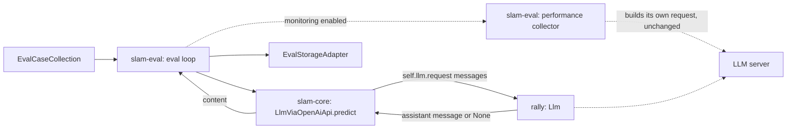

## 05-rally-request-migration-kiss-spec

### 1. Requirement analysis

#### 1.1 Motivation

The ecosystem requirement is that slam components take their LLM behaviour from the shared libraries they depend on, instead of rebuilding it themselves (constitution FR5 "shared core", NFR4 "modularity"). Rally has moved request construction inside the `Llm` object: `Llm.request(message_history)` is now the only entry point, and the module-level request functions are gone.

What is missing: `slam_core.model.LlmViaOpenAiApi` still builds its request by calling a removed module-level function and re-listing server url, authorization, model name and output-token limit itself. As a result the model does not import at all, every slam repo that imports `slam_core.model` is blocked, and generation behaviour that belongs to the `Llm` — notably thinking control — never reaches the request.

#### 1.2 Functional requirements

**FR1.** `LlmViaOpenAiApi.predict` obtains the assistant message through the `Llm` instance it holds — `self.llm.request(messages)` — passing the message list as the only argument. Exactly one request is issued per `predict` call.

**FR2.** `slam-core` imports no rally symbol other than `Llm`, and no module-level rally request function is referenced anywhere in the slam repos — production code or tests.

**FR3.** Generation parameters (server url, authorization, model name, output-token limit, thinking control) are supplied by the `Llm` object and are not re-listed at the call site: changing any of them requires no change in slam-core.

**FR4.** A `Llm` configured with `enable_thinking` therefore reaches the request unchanged — thinking control works for the OpenAI-compatible model with no slam-core code, and no slam-core code strips or inspects the reasoning trace.

**FR5.** When the `Llm` returns `None` (the request failed), `predict` raises an explicit error naming the model, instead of failing on a subscript of `None`.

**FR6.** Tests exercise the boundary, not the old symbol: slam-core's model tests drive `predict` against a `Llm` double and assert the message list handed to it; slam-eval's end-to-end tests stub the request at the `Llm` boundary.

**FR7.** The slam repos import and their suites run again: `import slam_core.model` succeeds, slam-core's suite collects, and slam-eval's end-to-end suite collects and passes.

#### 1.3 Non-functional requirements

**NFR1.** Only `rally.llm.Llm` is imported from rally by slam-core; the removed module-level functions appear nowhere in the slam repos.

**NFR2.** The message list slam-core assembles is unchanged: the system message when a system prompt is present, then the user message.

**NFR3.** No new dependencies; the suites run in the existing `~/venvs/slam`.

**NFR4.** The repository's own linters (black, isort, pylint, mypy) report no message that is absent from the pre-change commit.

**NFR5.** Scope: the performance-monitoring collection path in slam-eval is not modified by this spec; it bypasses `predict` today and continues to do so.

**NFR6.** On the `predict` path the only intended change to what goes on the wire is the thinking-control key now being sent when configured; the remaining keys and the message list are identical to today. This is measured against the pre-change revision, not asserted.

#### 1.4 Expected behavioural variants

| # | Situation | Expected behaviour |
|---|-----------|--------------------|
| 1 | `predict` with a system prompt | the `Llm` receives `[system, user]` |
| 2 | `predict` without a system prompt | the `Llm` receives `[user]` |
| 3 | the `Llm` returns an assistant message | `predict` returns its `content` |
| 4 | the `Llm` returns `None` (request failed) | `predict` raises an error naming the model (today: `TypeError` on subscripting `None`) |
| 5 | `enable_thinking` configured on the `Llm` | the value reaches the request through the `Llm`; slam-core passes no generation parameter and no thinking key of its own |
| 6 | `enable_thinking` unset | no thinking key is sent; the request is otherwise as today |
| 7 | url / authorization / model / output-token limit configured | read by the `Llm`, not re-listed at the call site |
| 8 | the assistant `content` carries a reasoning trace | returned verbatim by `predict` (unchanged); no removal happens in slam-core |
| 9 | any slam module imports `slam_core.model` | import succeeds; no reference to the removed functions anywhere in slam-core or slam-eval |
| 10 | slam-eval end-to-end run with the request stubbed at the `Llm` boundary | answers and scores are the ones the suite asserts today |
| 11 | `predict` called repeatedly with different inputs | one `Llm.request` call per `predict`, in order, no caching |
| 12 | performance monitoring enabled during an eval run | unchanged by this spec: the collector path still builds its own request |

### 2. Tests

All tests below are new or rewritten unless marked unchanged. "Row" refers to the §1.4 variant table.

| # | Test | File | Covers |
|---|------|------|--------|
| T1 | `test_init` — name and `Llm` object are stored (unchanged) | `slam-core/tests/test_model.py` | FR1 |
| T2 | `test_predict_passes_system_and_user_messages` — `llm.request` is called once with `[{"role": "system", ...}, {"role": "user", ...}]` | same | row 1, NFR2 |
| T3 | `test_predict_passes_user_message_only` — called with `[{"role": "user", ...}]` | same | row 2, NFR2 |
| T4 | `test_predict_returns_llm_content` — the returned message's `content` is what `predict` returns | same | row 3 |
| T5 | `test_predict_raises_when_llm_returns_none` — raises and the message names the model | same | row 4, FR5 |
| T6 | `test_predict_passes_no_generation_parameters` — exactly one call; `call_args.args == (messages,)` and `call_args.kwargs == {}` | same | rows 5, 7, 11; FR1, FR3 |
| T7 | `test_predict_issues_one_request_per_call` — two predicts with different inputs issue two calls, in order | same | row 11 |
| T8 | `test_predict_returns_reasoning_trace_verbatim` — content containing `<think>...</think>` is returned unchanged | same | row 8 |
| T9 | `test_module_surface_has_no_removed_request_functions` — `slam_core.model` exposes neither `request_based_on_message_history` nor `request_based_on_prompts`, and imports only `Llm` from rally | same | row 9, FR2, NFR1 |
| T10 | `test_predict_sends_thinking_key_through_llm` — a real `Llm` (url, model, `max_output_tokens`) with `requests.post` stubbed: `enable_thinking` True and False put `chat_template_kwargs == {"enable_thinking": <value>}` in the body; unset leaves the key absent and the remaining body keys identical | same | rows 5, 6; NFR6 |
| T11 | `test_main_with_simple_scorer` — request stubbed at `rally.llm.Llm.request` (was the `slam_core.model` module symbol); expected stored results unchanged | `slam-eval/tests/e2e/test_main.py` | row 10 |
| T12 | `test_main_with_complex_scorer` — same re-point | same | row 10 |
| T13 | `slam-eval/tests/test_performance_monitor.py` and slam-core's remaining suites (`test_collection`, `test_config`, `test_embedding_classifier`, `test_local_causal_lm`, `test_scorer`, `test_storage_adapter`) pass unchanged | `slam-core`, `slam-eval` | row 12, FR7 |

Verification commands, run with the project interpreter `~/venvs/slam/bin/python`:

```
python -c "import slam_core.model"          # row 9
cd slam-core && python -m pytest -q          # baseline: 5 collection errors -> all pass
cd slam-eval && python -m pytest -q          # baseline: 1 collection error -> all pass
```

NFR6 payload probe: capture the request body with the same stubbed transport on the untouched revision (a worktree of `main`) and on the change; the diff must be the thinking key and nothing else. This is run at implementation time, not asserted from the test alone.

### 3. Implementation plan

#### 3.1 Implementation repos

- **slam-core** (management repo) — the OpenAI-compatible model and its tests.
- **slam-eval** — the end-to-end tests that stub the request at the `Llm` boundary.

No other slam repo is involved: they reach the OpenAI-compatible model only through slam-core.

#### 3.2 High-level design



#### 3.3 Todo list

1. [ ] Write the tests
2. [ ] Run all the tests and ensure that they fail
3. [ ] Replace the module-level request call in `slam_core/model.py` with `self.llm.request(messages)`, drop the `rally.interaction` import, and raise an error naming the model when the response is `None`
4. [ ] Run slam-core's suite and the import check
5. [ ] Re-point both slam-eval end-to-end stubs to `rally.llm.Llm.request` and run slam-eval's suite
6. [ ] Run the payload probe against a `main` worktree and record the diff
7. [ ] Run the linters on the changed files and compare with `main`
8. [ ] Commit

#### 3.4 Modification summary

| File | Repo | Action |
|------|------|--------|
| `slam_core/model.py` | slam-core | Modified: request through `self.llm`; drop the `rally.interaction` import; raise on a `None` response |
| `tests/test_model.py` | slam-core | Modified: tests T1–T10 |
| `tests/e2e/test_main.py` | slam-eval | Modified: re-point both request stubs to `rally.llm.Llm.request` |
| `.internal/specs/05-rally-request-migration-kiss-spec.md` | slam-core | New |
