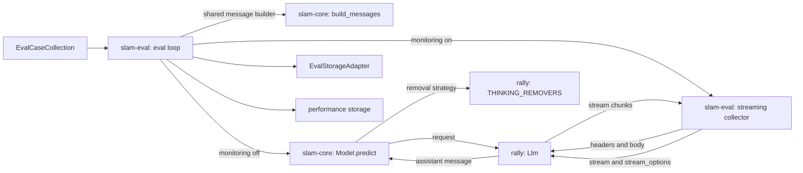

## 06-collector-llm-request-kiss-spec

### 1. Requirement analysis

#### 1.1 Motivation

The ecosystem requirement is that one place decides what an LLM request is (constitution FR5 "shared core", NFR4 "modularity"): rally owns the request shape, slam-core wraps it in `Model` classes, and a consumer must not rebuild a request of its own.

What is missing: with performance monitoring enabled, slam-eval's streaming collector performs the prediction itself and builds that request from scratch — its own endpoint, its own headers, its own field list, its own copy of the message assembly, and its own transport: it frames the stream, strips `data:`, looks for `[DONE]`, reads deltas and the usage chunk, and classifies failures from HTTP codes. Generation behaviour configured on the `Llm` never reaches the measured request, so the output-token cap and thinking control are dead configuration while monitoring is on and the two paths disagree about the same config. The request the eval measures is only assumed to be the request `predict` would make, because nothing compares them. And the transport duplicates rally's streaming operation (`Llm.stream`, landed), which already owns the framing, the provider dialect, end-of-stream, the timeout and the failure family.

The same requirement applies on the response side. How a reasoning trace is removed from a completion depends on the model family, and rally owns that rule (`THINKING_REMOVERS`). slam-core's local in-process model instead implements one hard-coded removal of its own, coupled to the thinking flag: it cannot express per-family strategies, and what it removes is not the ecosystem's rule.

Two further rules rally already owns are kept as copies inside slam. The message rule: rally's `make_up_message_history` could not express an absent system prompt, so `LlmViaOpenAiApi.predict` and the eval loop each kept a builder of their own. The in-process prompt: the eval loop re-derives the chat template — `tokenize=False`, `add_generation_prompt=True`, `chat_template_kwargs` — that `LocalCausalLm.predict` applies, in order to count prompt tokens.

#### 1.2 Functional requirements

**FR1.** The collector is given the `Llm` and calls `llm.stream(messages)` for the monitored prediction; it holds no url, authorization, model, body, header or framing of its own. The streaming keys, the provider dialect (framing, `data:`, `[DONE]`, delta spellings, the usage chunk, end-of-stream) and the timeout are rally's.

**FR2.** Generation behaviour configured on the `Llm` therefore reaches the monitored request without slam-eval knowing about it: the cap under both key names rally sends, thinking control through `chat_template_kwargs`, and the streaming keys rally adds itself.

**FR3.** Equivalence is structural rather than asserted: for the same messages and the same `Llm`, the monitored request is the prediction request, because both are the same rally call on the same object — same endpoint, same headers, same body, plus the streaming keys rally adds.

**FR4.** Failures arrive as rally's typed errors and are mapped onto slam-eval's records: `LlmAuthorizationError` becomes `RuntimeError` and the run aborts, never a silent fallback; `LlmStreamRejectedError` yields the fallback record `streaming_request_rejected`; `LlmTransportError` and `LlmTimeoutError` yield a fallback record with `e2e_time_s: None`. The non-streaming path keeps rally's `None` contract, so its failures are recorded without a reason — accepted, recorded in NFR4, and left for a later rally spec that gives every path one failure vocabulary.

**FR5.** The messages are assembled by rally's `make_up_message_history`, widened to accept an absent system prompt, and that one call serves `LlmViaOpenAiApi.predict`, `LocalCausalLm.predict` and the eval loop; neither slam repo keeps a copy of the rule.

**FR6.** The eval loop passes no request-shaping parameter to the collector and no longer aborts when no cap is configured — the cap is whatever the `Llm` carries, and an unset cap simply means no cap key goes out.

**FR7.** Measurement semantics are unchanged: TTFT from the arrival of the first event carrying content, TPOT from inter-event arrival deltas, server usage preferred over content-event counting for the token counts, and the streaming-unavailability contract keeps its three signals — the `supported`/`fallback_reason` block in run metadata, `n: 0` aggregates instead of omitted ones, and a warning emitted only when the fallback is not config-intended.

**FR8.** A stream the server ends by truncation — `finish_reason: "length"` — is the completed answer, not a failure: the content that arrived (possibly none) is recorded as the answer, with the timings that content allows, the token counts as usual, `supported: true` and no warning. The streaming-unavailability path therefore applies only to a request that failed, or to a stream that produced no content and did not declare truncation.

**FR9.** `LocalCausalLm` answers the prompt-token count for the input it actually sends, and the eval loop takes its prompt-token count from there instead of re-deriving the chat template, so the counted prompt cannot drift from the sent prompt.

**FR10.** `LocalCausalLm` takes its reasoning-trace removal strategy from rally's family registry — `THINKING_REMOVERS[model_family]` — and keeps no removal rule of its own: no regular expression, no tag parsing.

**FR11.** `LocalCausalLm` declares its model family as a constructor argument set from config, and whether the strategy is applied is controlled by a dedicated boolean config flag, independent of `enable_thinking` — the chat-template flag and the post-processing flag are separate knobs and any combination is allowed. On the remote path the same `enable_thinking` setting is a request-body field written by rally, so one setting has one applier per transport, and the removal side is asymmetric by design: the in-process path trims under its flag, the remote path never trims.

**FR12.** An unknown or missing family is rally's lookup failing; slam-core adds no validation, default or fallback of its own.

#### 1.3 Non-functional requirements

**NFR1.** rally remains the only place that knows the request envelope and owns the transport, the provider dialect and the failure vocabulary; slam-core owns the message contents it passes in and the in-process engine; slam-eval owns the measurement of what came back and the records it writes.

**NFR2.** No new dependencies; the suites run in the existing `~/venvs/slam`.

**NFR3.** The repository's linters report no message that is absent from the pre-change commit.

**NFR4.** Metric keys, aggregation and the record shape are unchanged, with one accepted exception: a non-streaming failure is recorded as `e2e_time_s: None` with no reason, where today a rejection omits that key and a transport failure sets it, because rally's `request()` reports both as `None`.

**NFR5.** Intended wire changes, measured against the pre-change revision rather than asserted: `max_completion_tokens` is added on both the streaming and the non-streaming path, `chat_template_kwargs` is added when thinking is configured, and the empty `model` field the old collector always sent for a config whose `Llm` carries no model is no longer sent; nothing else is removed.

**NFR6.** The consequences of the thinking flag now applying are accepted and documented: the streamed content may carry the reasoning trace, which becomes `y_pred` and therefore the score; TTFT and `generated_tokens` include the reasoning while the flag is on, so thinking-on and thinking-off runs are not comparable; and a cap below the reasoning budget truncates the stream, which is recorded as the completed (possibly empty) answer per FR8 rather than as a failure. No removal of the trace happens in the collector — slam-core strips it only on the in-process path.

**NFR7.** Scope: the memory sampler, the statistics registry and the storage adapter are untouched. rally is modified only by the `make_up_message_history` widening, which lands on its own without a spec; everything else stays inside slam-core and slam-eval.

**NFR8.** The behaviour changes of adopting rally's strategies are recorded, not hidden: with the flag on and family `qwen3` the completion becomes what rally's entry returns (as the registry stands, the last line), where today the block is stripped and the whole remaining text is kept; with family `qwen2.5` nothing is removed, where today the block is stripped; and with the flag off nothing is removed regardless of `enable_thinking`, where today thinking-disabled implies removal.

#### 1.4 Expected behavioural variants

| # | Situation | Expected behaviour |
|---|-----------|--------------------|
| 1 | `enable_thinking` configured on the `Llm` | the body carries `chat_template_kwargs` with that value (today: absent, flag ignored) |
| 2 | `enable_thinking` unset | no `chat_template_kwargs` key is sent |
| 3 | cap configured on the `Llm` | the body carries `max_completion_tokens` and `max_tokens` with the cap |
| 4 | no cap configured | neither cap key is sent and the run proceeds (today: the run aborts) |
| 5 | authorization configured | the `Authorization` header is sent verbatim (unchanged) |
| 6 | no authorization | no `Authorization` header (unchanged) |
| 7 | streaming request | the collector calls `llm.stream(messages)`: the request is rally's — the `Llm`'s own body plus the two streaming keys rally adds (today: slam-eval's own body with one cap key) |
| 8 | non-streaming request | the collector calls `llm.request(messages)`: the `Llm`'s own body, no streaming keys (today: a second hand-built body) |
| 9 | same messages, same `Llm` | the monitored request *is* the prediction request, both being the same rally call on the same object |
| 10 | system prompt present / absent | rally's widened helper yields `[system, user]` / `[user]`, and `predict`, the in-process model and the eval loop all call it (today: two private copies) |
| 11 | HTTP 401 or 403 | rally raises `LlmAuthorizationError`; slam-eval raises `RuntimeError`, the run aborts, never a silent metrics fallback |
| 12 | other HTTP status | rally raises `LlmStreamRejectedError`; fallback record, `supported: false`, `fallback_reason: streaming_request_rejected`, warning unless config-intended |
| 13 | no data within a configured timeout | rally raises `LlmTimeoutError`; fallback record with `e2e_time_s: None` (unreachable while no timeout is configured — accepted) |
| 14 | transport error, including a stream dropped mid-answer | rally raises `LlmTransportError`; fallback record with `e2e_time_s: None`, never a fabricated zero |
| 15 | stream ends truncated by the cap, some content arrived | the answer is what arrived; recorded as the completed answer — `supported: true`, no warning (FR8) |
| 16 | stream ends truncated by the cap, no content arrived (the reasoning consumed the budget) | the empty answer is recorded as the completed one (FR8); no fallback, no warning |
| 17 | stream ends with no content and no declared truncation | streaming unavailability is reported, not an error, with a warning unless config-intended |
| 18 | non-streaming request fails | rally's `request()` returns `None`: fallback record with `e2e_time_s: None` and no reason (the accepted coarseness of NFR4) |
| 19 | server reports no usage | token counts from content-event counting, `tokens_source: chunk_count`, usage warning (unchanged) |
| 20 | thinking on and the content carries a reasoning trace | the trace reaches `y_pred` and the score follows it (accepted consequence) |
| 21 | removal flag on, family `qwen3`, trace present | rally's `qwen3` strategy is applied to the completion |
| 22 | removal flag on, family `qwq` | rally's `qwq` strategy is applied |
| 23 | removal flag on, family `qwen2.5` | nothing is removed: rally's entry is the identity function |
| 24 | removal flag off, trace present | the completion is returned verbatim, no trimming, no whitespace handling |
| 25 | removal flag on and `enable_thinking` true | the strategy is applied anyway — the two knobs are independent |
| 26 | family absent from rally's registry | rally's lookup raises; slam-core neither catches it nor falls back |
| 27 | `enable_thinking` set or unset | still passed to the chat template exactly as today |
| 28 | step callback configured | per-token callback behaviour unchanged |
| 29 | prompt-token count for the in-process path | the count comes from the model's own renderer, so it is the prompt the model was given (today: a re-derived template) |

### 2. Tests

All tests below are new or re-pointed; "row" refers to the §1.4 variant table.

Test infrastructure: the collector's tests need no HTTP server and no stub transport. They use a stub `Llm` whose `stream()` yields scripted `LlmStreamEvent`s and records the messages it was called with, whose `request()` returns a scripted message, and which raises rally's own error classes to script failures. Timing tests insert a short sleep between yielded events, so TTFT and TPOT are measurable and ordered.

| # | Test | File | Covers |
|---|------|------|--------|
| T1 | `test_predict_passes_system_and_user_messages` — re-pointed: the argument equals rally's `make_up_message_history(...)`, not a private list | `slam-core/tests/test_model.py` | row 10 |
| T2 | `test_predict_passes_user_message_only` — re-pointed: an absent system prompt yields `[user]` | same | row 10 |
| T3 | `test_predict_goes_through_rallys_helper` — rally's helper patched in `slam_core.model`, so predict keeps no copy of the rule | same | FR5 |
| T4 | `test_removal_strategy_comes_from_rally_registry` — a recording entry in `THINKING_REMOVERS` receives the completion and its return value is what predict returns, for `qwen3`, `qwq` and `qwen2.5` | `slam-core/tests/test_local_causal_lm.py` | rows 21–23 |
| T5 | `test_remove_thinking_flag_off_returns_the_completion_verbatim` | same | row 24 |
| T6 | `test_remove_thinking_and_enable_thinking_are_independent` — flag on with thinking on trims; flag off with thinking off does not | same | row 25 |
| T7 | `test_unknown_family_is_not_handled_by_slam_core` — a family outside the registry raises from rally's lookup | same | row 26 |
| T8 | `test_prompt_token_count_matches_the_prompt_the_model_is_given` — the count equals the tokenizer's count of the prompt the model is sent | same | row 29 |
| T9 | `test_prompt_token_count_uses_the_same_template_call_as_predict` — the tokenizer's `apply_chat_template` recorded as the existing template tests already record it: predict and the count pass identical messages and arguments | same | row 29, FR9 |
| T10 | existing chat-template tests kept: `test_thinking_setting_passed_to_chat_template`, `test_unset_thinking_setting_not_passed_to_chat_template`, `test_system_prompt_included_in_chat_template` | same | row 27 |
| T11 | existing step-callback tests unchanged | same | row 28 |
| T12 | `test_collector_calls_the_llms_stream_with_the_messages` — the messages arrive unchanged at `llm.stream` | `slam-eval/tests/test_performance_monitor.py` | rows 7, 9 |
| T13 | `test_non_streaming_measurement_calls_the_llms_request` | same | row 8 |
| T14 | `test_ttft_and_tpot_come_from_event_arrival` — TTFT at the first content event, TPOT from inter-event arrival deltas | same | row 19 |
| T15 | `test_usage_is_preferred_over_content_event_counting` | same | row 19 |
| T16 | `test_absent_usage_falls_back_to_content_event_counting` — `tokens_source: chunk_count` and the usage note on the run | same | row 19 |
| T17 | `test_authorization_error_aborts` — `LlmAuthorizationError` becomes `RuntimeError`, never a fallback record | same | row 11 |
| T18 | `test_rejected_streaming_request_falls_back` — `LlmStreamRejectedError` yields `streaming_request_rejected` | same | row 12 |
| T19 | `test_transport_error_falls_back_without_e2e` — `LlmTransportError` yields `e2e_time_s: None` | same | row 14 |
| T20 | `test_timeout_gives_the_same_record_as_a_transport_error` | same | row 13 |
| T21 | `test_truncated_stream_is_the_completed_answer` — reasoning-only events ending with `finish_reason: "length"`: `streaming_failed: False`, content empty, `supported: true`, no warning | same | rows 15, 16 |
| T22 | `test_truncated_stream_with_partial_content_keeps_the_content` | same | row 15 |
| T23 | `test_no_content_and_no_finish_reason_reports_unavailability` | same | row 17 |
| T24 | `test_non_streaming_failure_record_shape` — `request()` returns `None`: fallback with `e2e_time_s: None` and no reason | same | row 18 |
| T25 | `test_thinking_trace_in_content_reaches_y_pred_verbatim` | same | row 20 |
| T26 | `test_collector_and_predict_send_the_same_messages` — the same `Llm` and case: the collector's `stream` call and `LlmViaOpenAiApi.predict`'s `request` call receive equal message lists | same | rows 9, 10 |
| T27 | `test_disabled_in_config_reflected_at_construction` (unchanged) | same | config-intended fallback |
| T28 | `test_monitoring_enabled_run_completes_without_a_cap` — no cap configured, one record per case, no abort | `slam-eval/tests/e2e/test_main.py` | row 4 |
| T29 | `test_collector_is_built_from_the_models_llm` | same | row 9 |
| T30 | `test_in_process_run_counts_prompt_tokens_from_the_model` — the loop no longer applies the chat template itself | same | row 29, FR9 |

Verification, run with the project interpreter `~/venvs/slam/bin/python` and `SLAM_SHARED_CONFIG_PATH` exported (slam-eval's Hydra composition needs it):

```
cd slam-core && python -m pytest -q      # baseline measured on the pre-change revision
cd slam-eval && python -m pytest -q      # baseline measured on the pre-change revision
```

The baselines are re-measured at implementation time on the actual pre-change revision of each repository (79 and 29 passed at planning).

NFR5 wire probe, restated for the new shape: the collector no longer builds a body, so the probe compares slam-eval's old hand-built request — captured on a pre-change worktree with a stubbed transport — against rally's request for the same `Llm` and the same messages, `build_payload(messages)` plus the streaming keys, streaming against streaming and non-streaming against non-streaming. The expected additions are `max_completion_tokens` on both paths and `chat_template_kwargs` when thinking is configured. The expected removal, and the one place the two bodies are not merely additive: the old collector always sent `"model"`, filled with `llm.model or ""`, so a config whose `Llm` carries no model (`local_llm.yaml`) sent `"model": ""`, while rally omits the key when the `Llm` has no model. The probe records that removal rather than hiding it; nothing else disappears.

### 3. Implementation plan

#### 3.1 Implementation repos

- **slam-core** (management repo) — the shared message builder, the local model's thinking-removal change, the model config, and their tests.
- **slam-eval** — the collector (constructor, headers and body from the `Llm`), the eval-loop wiring, and the tests.

#### 3.2 High-level design



#### 3.3 Todo list

1. [ ] Write the tests
2. [ ] Run all the tests and ensure that they fail
3. [ ] slam-core: add the shared message builder and use it in `predict` (T1–T3)
4. [ ] slam-eval: the collector takes the `Llm`, obtains headers and body from it, layers only the streaming keys, and drops the per-call cap argument (T4–T12, T15, T16)
5. [ ] slam-eval: the eval loop uses the shared builder, the collector is built from the model's `Llm`, and the cap guard is gone (T13)
6. [ ] slam-core: `LocalCausalLm` takes `model_family` and `remove_thinking`, removes its own regex, and trims through rally's registry; add both keys to the local model config (T17–T22)
7. [ ] Run both suites
8. [ ] Run the NFR5 wire probe against a pre-change worktree
9. [ ] Run the linters and compare with the pre-change revision
10. [ ] Commit

#### 3.4 Modification summary

| File | Repo | Action |
|------|------|--------|
| `slam_core/model.py` | slam-core | Modified: add the shared message builder and use it in `predict`; `LocalCausalLm` gains `model_family` and `remove_thinking` and trims through rally's registry instead of its own regex |
| `config/model/local_hf_causal_lm.yaml` | slam-core | Modified: `remove_thinking: true`, `model_family: qwen3` |
| `tests/test_model.py` | slam-core | Modified: T1–T3 |
| `tests/test_local_causal_lm.py` | slam-core | Modified: T17–T22 |
| `slam_eval/performance/openai_collector.py` | slam-eval | Modified: constructor takes the `Llm`; headers and body from `build_headers()`/`build_payload()`; streaming keys layered; per-call cap argument dropped |
| `slam_eval/scripts/main.py` | slam-eval | Modified: shared message builder, collector from the model's `Llm`, cap guard removed |
| `tests/test_performance_monitor.py` | slam-eval | Modified: T4–T12, T14–T16 |
| `tests/e2e/test_main.py` | slam-eval | Modified: T13 |
| `.internal/specs/06-collector-llm-request-kiss-spec.md` | slam-core | New |
