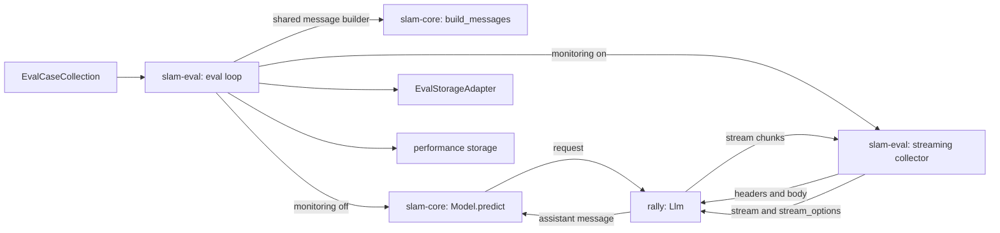

## 06-collector-llm-request-kiss-spec

### 1. Requirement analysis

#### 1.1 Motivation

The ecosystem requirement is that one place decides what an LLM request is (constitution FR5 "shared core", NFR4 "modularity"): rally owns the request shape, slam-core wraps it in `Model` classes, and a consumer must not rebuild a request of its own.

What is missing: with performance monitoring enabled, slam-eval's streaming collector performs the prediction itself and builds that request from scratch — its own endpoint, its own headers, its own field list, and its own copy of the message assembly. Two consequences follow. Generation behaviour configured on the `Llm` never reaches the measured request, so the output-token cap and thinking control are dead configuration while monitoring is on and the two paths disagree about the same config. And the request the eval measures is only assumed to be the request `predict` would make, because nothing compares them.

#### 1.2 Functional requirements

**FR1.** The collector obtains the endpoint, the headers and the body from the `Llm` it is given — `build_headers()` and `build_payload(messages)` — and holds no url, authorization or model field of its own.

**FR2.** The collector adds exactly the streaming keys (`stream: True`, `stream_options: {"include_usage": True}`) to that body. The non-streaming request adds nothing. One body construction serves both paths.

**FR3.** Generation behaviour configured on the `Llm` therefore reaches the monitored request without slam-eval knowing about it: the output-token cap under both key names rally sends, and thinking control through `chat_template_kwargs` when `enable_thinking` is configured.

**FR4.** Equivalence: for the same messages and the same `Llm`, the monitored request equals the prediction request — same endpoint, same headers, same body modulo the streaming keys.

**FR5.** The messages are assembled in exactly one place, in slam-core, and used by both `predict` and the eval loop; slam-eval keeps no second copy of the rule.

**FR6.** The eval loop passes no request-shaping parameter to the collector and no longer aborts when no cap is configured — the cap is whatever the `Llm` carries, and an unset cap simply means no cap key goes out.

**FR7.** Measurement semantics are unchanged: TTFT from the first content chunk, TPOT from inter-chunk deltas, server usage preferred over chunk counting for token counts, and the streaming-unavailability contract keeps its three signals — the `supported`/`fallback_reason` block in run metadata, `n: 0` aggregates instead of omitted ones, and a warning emitted only when the fallback is not config-intended. Authorization failure still raises; other failures still produce a fallback record with `e2e_time_s: None`.

**FR8.** Tests assert the collector's request against the `Llm`'s own builder output — equivalence, headers, the thinking key, both cap keys — and the existing measurement, fallback, authorization and streaming-disabled behaviour stays green on the new constructor.

#### 1.3 Non-functional requirements

**NFR1.** rally remains the only place that knows the OpenAI request shape; slam-eval knows only the two streaming keys.

**NFR2.** No new dependencies; the suites run in the existing `~/venvs/slam`.

**NFR3.** The repository's linters report no message that is absent from the pre-change commit.

**NFR4.** Metric keys, record shape and aggregation are unchanged; stored artifacts remain readable by the existing reader.

**NFR5.** Intended wire changes, measured against the pre-change revision rather than asserted: `max_completion_tokens` is added on both the streaming and the non-streaming path, `chat_template_kwargs` is added when thinking is configured, and nothing is removed.

**NFR6.** The consequences of the thinking flag now applying are accepted and documented: the streamed content may carry the reasoning trace, which becomes `y_pred` and therefore the score; TTFT and `generated_tokens` include the reasoning while the flag is on, so thinking-on and thinking-off runs are not comparable; and with the flag on and a cap below the reasoning budget the collector reports streaming unavailability instead of an error. No removal of the trace happens here — slam-core strips it only on the in-process path, and rally's opt-in removal helper is not implemented.

**NFR7.** Scope: the in-process `LocalCausalLm` path, the memory sampler, the statistics registry and the storage adapter are untouched, and rally itself is not modified.

#### 1.4 Expected behavioural variants

| # | Situation | Expected behaviour |
|---|-----------|--------------------|
| 1 | `enable_thinking` configured on the `Llm` | the body carries `chat_template_kwargs` with that value (today: absent, flag ignored) |
| 2 | `enable_thinking` unset | no `chat_template_kwargs` key is sent |
| 3 | cap configured on the `Llm` | the body carries `max_completion_tokens` and `max_tokens` with the cap |
| 4 | no cap configured | neither cap key is sent and the run proceeds (today: the run aborts) |
| 5 | authorization configured | the `Authorization` header is sent verbatim (unchanged) |
| 6 | no authorization | no `Authorization` header (unchanged) |
| 7 | streaming request | body equals the `Llm` body plus `stream` and `stream_options` |
| 8 | non-streaming request | body equals the `Llm` body, no streaming keys |
| 9 | same messages, same `Llm` | the monitored request equals the prediction request — endpoint, headers and body modulo the streaming keys |
| 10 | system prompt present / absent | the shared builder produces the same two message lists `predict` uses |
| 11 | HTTP 401 or 403 | `RuntimeError`, the run aborts, never a silent metrics fallback (unchanged) |
| 12 | other HTTP status | fallback record, `supported: false`, `fallback_reason: streaming_request_rejected`, warning unless config-intended (unchanged) |
| 13 | transport error | fallback record with `e2e_time_s: None`, never a fabricated zero (unchanged) |
| 14 | server reports no usage | token counts from chunk counting, `tokens_source: chunk_count`, usage warning (unchanged) |
| 15 | thinking on with a cap below the reasoning budget | no content chunks arrive; streaming unavailability is reported, not an error (accepted consequence) |
| 16 | thinking on and the content carries a reasoning trace | the trace reaches `y_pred` and the score follows it (accepted consequence) |

### 2. Tests

All tests below are new or re-pointed; "row" refers to the §1.4 variant table.

| # | Test | File | Covers |
|---|------|------|--------|
| T1 | `test_build_messages_with_system_and_user` — the shared builder returns `[system, user]` | `slam-core/tests/test_model.py` | row 10 |
| T2 | `test_build_messages_without_system` — returns `[user]` | same | row 10 |
| T3 | `test_predict_uses_the_shared_builder` — predict's argument equals `build_messages(x)` and the literal list | same | row 10 |
| T4 | `test_streaming_body_is_llm_payload_plus_stream_keys` — exact dict equality with `build_payload(messages)` plus `stream`/`stream_options` | `slam-eval/tests/test_performance_monitor.py` | row 7 |
| T5 | `test_non_streaming_body_is_llm_payload` — exact dict equality with `build_payload(messages)` | same | row 8 |
| T6 | `test_headers_come_from_the_llm` — equals `build_headers()`; `Authorization` present when configured and absent otherwise | same | rows 5, 6 |
| T7 | `test_request_goes_to_the_llm_endpoint` | same | row 9 |
| T8 | `test_thinking_key_reaches_the_collector_body` — configured → `chat_template_kwargs` with the value; unset → key absent | same | rows 1, 2 |
| T9 | `test_cap_keys_reach_the_collector_body` — configured → both cap keys with the value; unset → neither key and no raise | same | rows 3, 4 |
| T10 | `test_monitored_request_equals_prediction_request` — same `Llm` and messages: the collector body minus the streaming keys equals the body captured from `Llm.request` | same | row 9 |
| T11 | existing measurement tests re-pointed to the new constructor: usage-preferred TTFT/TPOT, chunk-count fallback, streaming rejected | same | rows 12, 14 |
| T12 | existing authorization test (401 → `RuntimeError`) and transport-error test (`e2e_time_s: None`) re-pointed | same | rows 11, 13 |
| T13 | monitored end-to-end run with a stubbed transport: completes with monitoring enabled, one record per case, no abort | `slam-eval/tests/e2e/test_main.py` | row 4, FR6 |
| T14 | `test_disabled_in_config_reflected_at_construction` (unchanged) | `slam-eval/tests/test_performance_monitor.py` | config-intended fallback |
| T15 | thinking on, no content chunks → streaming unavailability reported, not an error | same | row 15 |
| T16 | thinking on, the content carries a reasoning trace → the trace is returned verbatim (no stripping in the collector) | same | row 16 |

Verification, run with the project interpreter `~/venvs/slam/bin/python` and `SLAM_SHARED_CONFIG_PATH` exported (slam-eval's Hydra composition needs it):

```
cd slam-core && python -m pytest -q      # baseline: 79 passed
cd slam-eval && python -m pytest -q      # baseline: 29 passed
```

NFR5 wire probe: capture the collector's body with a stubbed transport on the pre-change slam-eval (a `git worktree` of its main) and on the change, for streaming and non-streaming with a cap configured, and with `enable_thinking` set and unset. The delta must be exactly `max_completion_tokens` on both paths plus `chat_template_kwargs` when thinking is configured, with nothing removed — measured at implementation time, not asserted from the tests alone.

### 3. Implementation plan

#### 3.1 Implementation repos

- **slam-core** (management repo) — the shared message builder in the model module, and its tests.
- **slam-eval** — the collector (constructor, headers and body from the `Llm`), the eval-loop wiring, and the tests.

#### 3.2 High-level design



#### 3.3 Todo list

1. [ ] Write the tests
2. [ ] Run all the tests and ensure that they fail
3. [ ] slam-core: add the shared message builder and use it in `predict` (T1–T3)
4. [ ] slam-eval: the collector takes the `Llm`, obtains headers and body from it, layers only the streaming keys, and drops the per-call cap argument (T4–T12, T15, T16)
5. [ ] slam-eval: the eval loop uses the shared builder, the collector is built from the model's `Llm`, and the cap guard is gone (T13)
6. [ ] Run both suites
7. [ ] Run the NFR5 wire probe against a pre-change worktree
8. [ ] Run the linters and compare with the pre-change revision
9. [ ] Commit

#### 3.4 Modification summary

| File | Repo | Action |
|------|------|--------|
| `slam_core/model.py` | slam-core | Modified: add the shared message builder, use it in `predict` |
| `tests/test_model.py` | slam-core | Modified: T1–T3 |
| `slam_eval/performance/openai_collector.py` | slam-eval | Modified: constructor takes the `Llm`; headers and body from `build_headers()`/`build_payload()`; streaming keys layered; per-call cap argument dropped |
| `slam_eval/scripts/main.py` | slam-eval | Modified: shared message builder, collector from the model's `Llm`, cap guard removed |
| `tests/test_performance_monitor.py` | slam-eval | Modified: T4–T12, T14–T16 |
| `tests/e2e/test_main.py` | slam-eval | Modified: T13 |
| `.internal/specs/06-collector-llm-request-kiss-spec.md` | slam-core | New |
